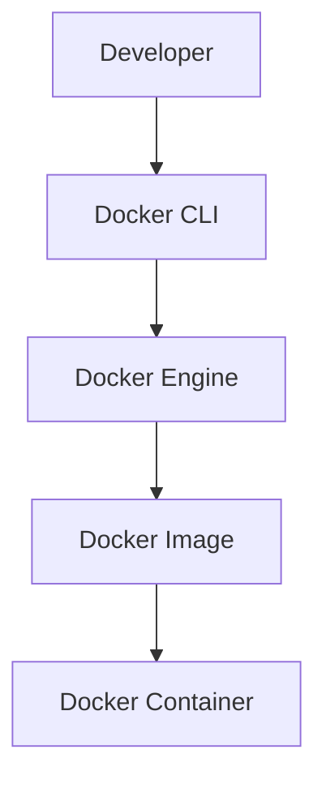
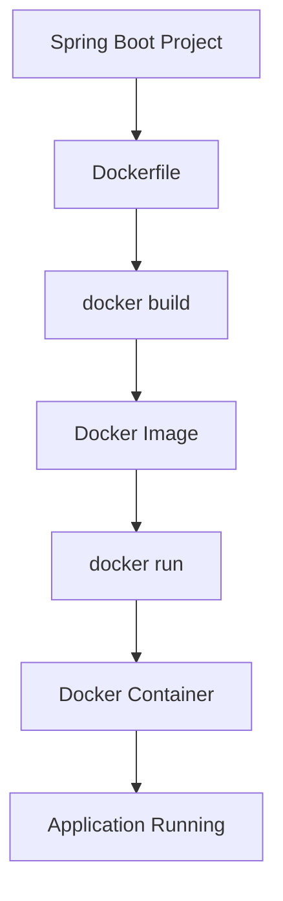
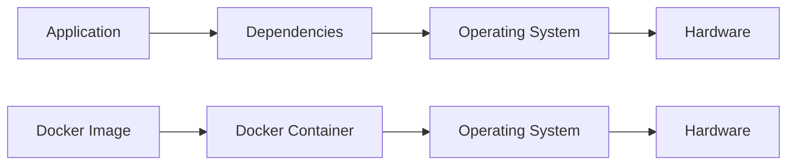

# Docker Fundamentals

## Overview

Docker is an open-source containerization platform that enables developers to package applications together with all their dependencies into lightweight, portable, and isolated containers.

Instead of worrying about differences between development, testing, and production environments, Docker ensures that the application behaves consistently everywhere.

Docker has become the industry standard for deploying modern backend applications, especially Spring Boot microservices.

---

# Repository Goal

This module answers one engineering question:

> **"What is Docker, and why has it become the standard for modern application deployment?"**

---

# What is Docker?

Docker is a platform that packages an application, its runtime, libraries, dependencies, and configuration into a single portable unit called a **Container**.

Unlike traditional deployments, Docker guarantees that the application behaves the same regardless of where it runs.

---

# Traditional Deployment

Without Docker, developers must manually install and configure every dependency.

```text
Application

↓

Java

↓

Maven

↓

Database

↓

Operating System

↓

Hardware
```

Every environment must be configured separately.

---

# Docker Deployment

With Docker

```text
Application

+

Dependencies

+

Java Runtime

↓

Docker Image

↓

Docker Container

↓

Runs Anywhere
```

Everything required to run the application is packaged together.

---

# Why Docker?

Docker solves one of the oldest problems in software engineering:

> "It works on my machine."

Without Docker

```text
Developer A

↓

Works

--------------------

Developer B

↓

Different Java Version

↓

Application Fails
```

With Docker

```text
Docker Image

↓

Developer A

↓

Runs

--------------------

Developer B

↓

Runs

--------------------

Production

↓

Runs
```

The environment becomes consistent across every machine.

---

# Docker Architecture

Docker consists of several components working together.

```text
Developer

↓

Docker CLI

↓

Docker Engine

↓

Docker Images

↓

Docker Containers
```

---

# Core Components

## Docker Engine

Docker Engine is the runtime responsible for:

- Building Images
- Running Containers
- Managing Networks
- Managing Volumes

It is the heart of Docker.

---

## Docker CLI

Developers interact with Docker using the command line.

Example

```bash
docker build

docker run

docker ps

docker compose up
```

The CLI communicates with Docker Engine.

---

## Docker Image

A Docker Image is an immutable blueprint used to create containers.

It contains:

- Operating System
- Runtime
- Dependencies
- Application
- Startup Instructions

Images are portable and reusable.

---

## Docker Container

A Docker Container is a running instance of an image.

Containers provide:

- Process Isolation
- File System Isolation
- Network Isolation

Applications execute inside containers.

---

## Docker Registry

Docker Registries store Docker Images.

Examples include:

- Docker Hub
- GitHub Container Registry
- Amazon ECR
- Azure Container Registry
- Google Artifact Registry

---

## Docker Hub

Docker Hub is the public registry provided by Docker.

Example

```bash
docker pull postgres:17
```

Docker downloads the PostgreSQL image from Docker Hub.

---

# Docker Workflow

```text
Spring Boot Project

↓

Dockerfile

↓

docker build

↓

Docker Image

↓

docker run

↓

Docker Container

↓

Application Running
```

This workflow is followed for nearly every Dockerized application.

---

# Why Containers?

Containers isolate applications while sharing the host operating system kernel.

Benefits include:

- Fast startup
- Low memory usage
- Portability
- Easy deployment
- Consistent environments

---

# Containers vs Virtual Machines

| Docker Containers | Virtual Machines |
|------------------|------------------|
| Share Host Kernel | Separate Guest OS |
| Lightweight | Heavyweight |
| Fast Startup | Slower Startup |
| Lower Memory Usage | Higher Memory Usage |
| Smaller Images | Larger Images |
| Ideal for Microservices | Ideal for Full OS Isolation |

Containers are significantly more efficient for modern cloud-native applications.

---

# Benefits of Docker

Docker provides numerous advantages.

## Consistency

Applications behave the same everywhere.

---

## Portability

Images can run on any machine with Docker installed.

---

## Isolation

Each application runs independently.

---

## Scalability

Containers can be replicated easily.

---

## Faster Deployment

Containers start in seconds.

---

## Better Resource Utilization

Containers share the host operating system kernel, reducing memory overhead.

---

## CI/CD Friendly

Docker integrates seamlessly with modern CI/CD pipelines.

---

# Docker Lifecycle

```text
Write Code

↓

Dockerfile

↓

docker build

↓

Docker Image

↓

docker run

↓

Container

↓

Application Running
```

This lifecycle forms the basis of every Docker deployment.

---

# Common Docker Commands

Check Docker Version

```bash
docker --version
```

List Images

```bash
docker images
```

List Running Containers

```bash
docker ps
```

List All Containers

```bash
docker ps -a
```

Build Image

```bash
docker build -t springboot-demo .
```

Run Container

```bash
docker run springboot-demo
```

Stop Container

```bash
docker stop container-name
```

Remove Container

```bash
docker rm container-name
```

Remove Image

```bash
docker rmi image-name
```

---

# Spring Boot Example

Traditional deployment

```text
Spring Boot

↓

Install Java

↓

Install Maven

↓

Build Project

↓

Run Jar
```

Docker deployment

```text
Spring Boot

↓

Dockerfile

↓

Docker Image

↓

Container

↓

Application Running
```

The deployment process becomes reproducible.

---

# Real-World Usage

Docker is widely used by:

- Netflix
- Amazon
- Uber
- Spotify
- Google
- Microsoft
- Red Hat
- Shopify

It is a foundational technology for cloud-native applications and microservices.

---

# Best Practices

✅ Use official Docker images.

---

✅ Version images explicitly.

---

✅ Keep images lightweight.

---

✅ Use containers for application isolation.

---

✅ Treat containers as disposable.

---

# Common Mistakes

❌ Assuming Docker is a Virtual Machine.

---

❌ Installing unnecessary software inside containers.

---

❌ Using the `latest` image tag everywhere.

---

❌ Running everything as the root user.

---

❌ Storing secrets inside Docker images.

---

# Mermaid Diagram — Docker Architecture



---

# Mermaid Diagram — Docker Workflow



---

# Mermaid Diagram — Traditional vs Docker Deployment



---

# Interview Notes

Frequently asked questions:

- What is Docker?
- Why was Docker created?
- What problems does Docker solve?
- What is Docker Engine?
- What is Docker CLI?
- What is a Docker Image?
- What is a Docker Container?
- What is Docker Hub?
- What is a Docker Registry?
- Docker vs Virtual Machine?
- Why are containers lightweight?
- What are the advantages of Docker?
- How does Docker improve deployment consistency?
- What is the Docker workflow?
- Why is Docker widely used in microservices?

---

# Key Takeaways

- Docker packages applications and dependencies into portable containers.
- Docker Images are immutable blueprints used to create containers.
- Docker Containers are isolated runtime instances of images.
- Docker provides consistency across development, testing, and production environments.
- Containers are lightweight compared to virtual machines because they share the host operating system kernel.
- Docker has become the industry standard for building, shipping, and running modern Spring Boot applications.