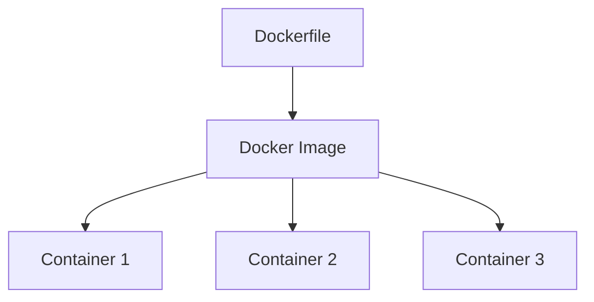
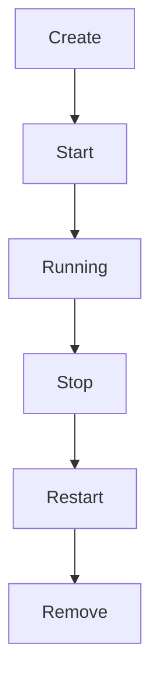

# Image vs Container

## Overview

One of the most fundamental concepts in Docker is understanding the difference between an **Image** and a **Container**.

Many beginners use these terms interchangeably, but they serve completely different purposes.

Understanding this distinction is essential before learning Dockerfiles, Docker Compose, Kubernetes, or deploying applications to production.

---

# What is a Docker Image?

A **Docker Image** is a **read-only blueprint** used to create Docker Containers.

It contains everything required to run an application, including:

- Application Code
- Runtime
- Libraries
- Dependencies
- Environment Configuration
- Startup Commands

Think of an image as a template.

```text
Docker Image

↓

Blueprint

↓

Creates Containers
```

---

# Image Characteristics

A Docker Image is:

- Read-only
- Immutable
- Portable
- Layered
- Versioned

Once built, an image does not change.

If changes are needed, a new image is built.

---

# Real-World Analogy

Think of a Docker Image as a class in Java.

```text
Java Class

↓

Blueprint

↓

Object
```

Similarly

```text
Docker Image

↓

Blueprint

↓

Container
```

One image can create many containers.

---

# What is a Docker Container?

A Docker Container is a **running instance of an Image**.

It is an isolated process with its own:

- File System
- Network
- Process Space
- Environment Variables

Containers are where applications actually execute.

---

# Container Characteristics

Containers are:

- Writable
- Running
- Isolated
- Temporary
- Lightweight

Unlike images,

containers maintain runtime state.

---

# Image to Container Relationship

```text
Docker Image

↓

Container 1

Container 2

Container 3
```

One image can create multiple independent containers.

---

# Example

Suppose we have

```text
springboot-app:1.0
```

Docker Image

We can create

```text
Container A

Container B

Container C
```

All three run independently.

---

# Image Lifecycle

```text
Application Source

↓

Dockerfile

↓

docker build

↓

Docker Image

↓

Docker Registry

↓

docker pull

↓

Docker Image

↓

docker run

↓

Container
```

---

# Container Lifecycle

```text
Create

↓

Start

↓

Running

↓

Stop

↓

Restart

↓

Remove
```

Docker manages this lifecycle automatically.

---

# Docker Image Layers

Docker Images are built using **layers**.

Example

```text
Ubuntu

↓

Java 21

↓

Maven

↓

Spring Boot Application
```

Each instruction in a Dockerfile creates a new layer.

---

# Layer Benefits

Layers provide

- Faster builds
- Smaller downloads
- Better caching
- Efficient updates

If only the application code changes,

Docker reuses the remaining layers.

---

# Copy-on-Write

Containers use **Copy-on-Write**.

```text
Docker Image

↓

Read Only

↓

Container

↓

Writable Layer
```

The image remains unchanged.

The container stores only runtime changes.

---

# Image Storage

Images are stored locally.

View them using

```bash
docker images
```

Example

```text
REPOSITORY

TAG

IMAGE ID

SIZE
```

---

# Container Storage

Running containers can be viewed using

```bash
docker ps
```

Stopped containers

```bash
docker ps -a
```

---

# Building an Image

```bash
docker build -t springboot-app .
```

Explanation

```text
docker build

↓

Read Dockerfile

↓

Create Image

↓

Tag Image

↓

springboot-app
```

---

# Running a Container

```bash
docker run springboot-app
```

Flow

```text
Docker Image

↓

Container Created

↓

Application Starts
```

---

# Naming Containers

Example

```bash
docker run --name patient-service springboot-app
```

Container Name

```text
patient-service
```

makes management easier.

---

# Stopping Containers

```bash
docker stop patient-service
```

Container

```text
Running

↓

Stopped
```

---

# Restarting Containers

```bash
docker start patient-service
```

No new container is created.

The existing one restarts.

---

# Removing Containers

```bash
docker rm patient-service
```

The container is deleted.

The image remains available.

---

# Removing Images

```bash
docker rmi springboot-app
```

Only the image is removed.

Running containers must be removed first.

---

# Image vs Container

| Docker Image | Docker Container |
|---------------|------------------|
| Blueprint | Running Instance |
| Read-only | Writable |
| Immutable | Mutable during runtime |
| Built once | Created many times |
| Stored locally/registry | Executes application |
| Creates Containers | Runs Application |

---

# Typical Workflow

```text
Write Code

↓

Dockerfile

↓

docker build

↓

Docker Image

↓

docker run

↓

Container

↓

Application Running
```

---

# Common Docker Commands

Build Image

```bash
docker build -t springboot-app .
```

List Images

```bash
docker images
```

Run Container

```bash
docker run springboot-app
```

Running Containers

```bash
docker ps
```

All Containers

```bash
docker ps -a
```

Stop Container

```bash
docker stop container-name
```

Remove Container

```bash
docker rm container-name
```

Remove Image

```bash
docker rmi image-name
```

---

# Best Practices

✅ Build immutable images.

---

✅ Tag images with versions.

Example

```text
springboot-app:1.0

springboot-app:1.1

springboot-app:2.0
```

Avoid relying on

```text
latest
```

for production deployments.

---

✅ Remove unused containers.

---

✅ Reuse images whenever possible.

---

# Common Mistakes

❌ Confusing images with containers.

---

❌ Modifying containers manually.

---

❌ Using `latest` in production.

---

❌ Building images repeatedly without cache optimization.

---

❌ Leaving unused containers consuming resources.

---

# Real-World Usage

Typical production deployment

```text
CI Pipeline

↓

Build Image

↓

Push Image

↓

Docker Registry

↓

Production Server

↓

Pull Image

↓

Run Container
```

Every deployment starts from a Docker Image.

---

# Mermaid Diagram — Image to Container



---

# Mermaid Diagram — Container Lifecycle



---

# Interview Notes

Frequently asked questions:

- What is a Docker Image?
- What is a Docker Container?
- Image vs Container?
- Can one Image create multiple Containers?
- Why are Images immutable?
- What is Copy-on-Write?
- What are Docker Layers?
- What happens when a Container is removed?
- Does removing a Container remove the Image?
- Why should Images be versioned?

---

# Key Takeaways

- A Docker Image is an immutable blueprint used to create containers.
- A Docker Container is a running instance of an image with its own isolated runtime environment.
- Images are built once and reused multiple times.
- Containers are lightweight, isolated, and disposable.
- Docker Layers improve build performance and storage efficiency.
- Understanding the distinction between Images and Containers is fundamental to working with Docker and containerized applications.