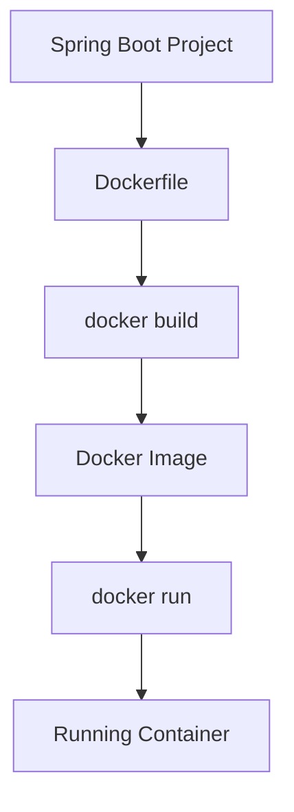
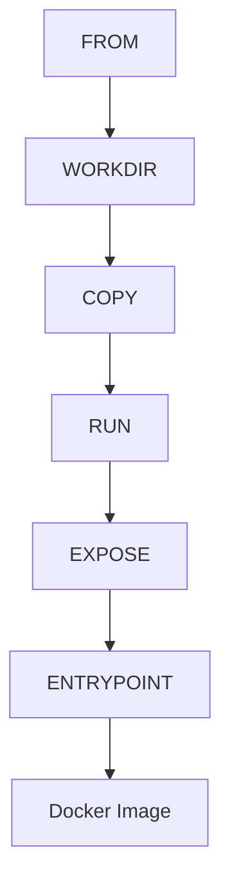

# Dockerfile

## Overview

A **Dockerfile** is a text file containing a sequence of instructions used by Docker to build an image.

It defines:

- Base Image
- Application Files
- Dependencies
- Build Steps
- Startup Command

Every Docker Image begins with a Dockerfile.

Without a Dockerfile,

Docker has no instructions for creating an image.

---

# Why Dockerfile?

Without Dockerfile

```text
Developer

↓

Install Java

↓

Install Maven

↓

Copy Code

↓

Build Project

↓

Run Application

↓

Repeat on Every Machine
```

Every developer repeats the same setup.

---

With Dockerfile

```text
Application

↓

Dockerfile

↓

docker build

↓

Docker Image

↓

docker run

↓

Application Running
```

The build process becomes reproducible.

---

# Dockerfile Workflow

```text
Spring Boot Project

↓

Dockerfile

↓

docker build

↓

Docker Image

↓

docker run

↓

Running Container
```

---

# Dockerfile Structure

A typical Dockerfile contains

```dockerfile
FROM

WORKDIR

COPY

RUN

EXPOSE

CMD
```

Each instruction creates a new image layer.

---

# Docker Build Process

```text
Dockerfile

↓

Read First Instruction

↓

Create Layer

↓

Read Second Instruction

↓

Create Layer

↓

Continue

↓

Docker Image
```

Docker caches layers to improve build speed.

---

# FROM

Every Dockerfile starts with

```dockerfile
FROM
```

Example

```dockerfile
FROM eclipse-temurin:21-jdk
```

Purpose

- Select Base Image
- Starting Point
- Operating System
- Java Runtime

Without FROM,

Docker cannot build an image.

---

# WORKDIR

Sets the working directory.

Example

```dockerfile
WORKDIR /app
```

Instead of repeatedly writing

```dockerfile
/app
```

Docker automatically uses this directory.

---

# COPY

Copies files from the local machine into the image.

Example

```dockerfile
COPY target/demo.jar app.jar
```

Flow

```text
Local Machine

↓

demo.jar

↓

Docker Image

↓

/app/app.jar
```

---

# RUN

Executes commands during image creation.

Example

```dockerfile
RUN apt-get update
```

or

```dockerfile
RUN chmod +x start.sh
```

RUN executes only while building the image.

---

# EXPOSE

Documents the application's listening port.

Example

```dockerfile
EXPOSE 8080
```

Meaning

```text
Container

↓

Application

↓

Port 8080
```

It does not automatically publish the port.

---

# CMD

Defines the default command executed when the container starts.

Example

```dockerfile
CMD ["java","-jar","app.jar"]
```

Flow

```text
docker run

↓

CMD

↓

Application Starts
```

Only one CMD should exist.

---

# ENTRYPOINT

ENTRYPOINT defines the executable that always runs.

Example

```dockerfile
ENTRYPOINT ["java","-jar","app.jar"]
```

Difference

CMD

```text
Default Command

↓

Can Be Overridden
```

ENTRYPOINT

```text
Fixed Executable

↓

Always Runs
```

Production Spring Boot images commonly use ENTRYPOINT.

---

# CMD vs ENTRYPOINT

| CMD | ENTRYPOINT |
|------|------------|
| Default command | Main executable |
| Easily overridden | Harder to override |
| Optional | Preferred for applications |
| Used for arguments | Used for startup process |

Example

```dockerfile
ENTRYPOINT ["java","-jar","app.jar"]

CMD ["--spring.profiles.active=prod"]
```

---

# Spring Boot Dockerfile

Example

```dockerfile
FROM eclipse-temurin:21-jdk

WORKDIR /app

COPY target/demo.jar app.jar

EXPOSE 8080

ENTRYPOINT ["java","-jar","app.jar"]
```

Build

```bash
docker build -t springboot-demo .
```

Run

```bash
docker run -p 8080:8080 springboot-demo
```

---

# Port Mapping

Docker maps

```text
Host Port

↓

Container Port
```

Example

```bash
docker run -p 8080:8080 springboot-demo
```

Meaning

```text
localhost:8080

↓

Container

↓

8080
```

---

# .dockerignore

Similar to

```text
.gitignore
```

It prevents unnecessary files from being copied.

Example

```text
target/

.git/

.idea/

.vscode/

README.md
```

Benefits

- Faster builds
- Smaller images
- Better caching

---

# Docker Cache

Docker caches image layers.

Example

```dockerfile
COPY pom.xml .

RUN mvn dependency:go-offline

COPY src src
```

Dependencies are cached.

Only source code rebuilds.

---

# Image Layers

Example

```text
Base Image

↓

Java

↓

Application

↓

Configuration

↓

Image
```

Every instruction creates a reusable layer.

---

# Building an Image

```bash
docker build -t springboot-demo .
```

Explanation

```text
docker build

↓

Dockerfile

↓

Image

↓

springboot-demo
```

---

# Running the Image

```bash
docker run springboot-demo
```

Flow

```text
Image

↓

Container

↓

Spring Boot Starts
```

---

# Viewing Image History

```bash
docker history springboot-demo
```

Displays

- Layers
- Commands
- Image Size

Useful for optimization.

---

# Multi-Stage Build (Introduction)

Instead of

```text
Source

↓

Maven

↓

Jar

↓

Runtime
```

inside one image,

Docker can separate

```text
Build Stage

↓

Runtime Stage
```

Result

- Smaller images
- Better security
- Faster deployments

A complete multi-stage build is covered in the next module.

---

# Best Practices

✅ Use official base images.

---

✅ Keep Dockerfiles small.

---

✅ Use `.dockerignore`.

---

✅ Minimize layers where practical.

---

✅ Use ENTRYPOINT for Spring Boot applications.

---

✅ Version base images explicitly.

Example

```dockerfile
FROM eclipse-temurin:21-jdk
```

instead of

```dockerfile
FROM latest
```

---

# Common Mistakes

❌ Using `latest` everywhere.

---

❌ Copying unnecessary files.

---

❌ Running as root.

---

❌ Building huge images.

---

❌ Installing development tools in runtime images.

---

# Real-World Example

CI Pipeline

```text
Git Push

↓

GitHub Actions

↓

docker build

↓

Docker Image

↓

Docker Registry

↓

Production Server

↓

docker pull

↓

docker run
```

Every deployment starts with a Dockerfile.

---

# Mermaid Diagram — Docker Build



---

# Mermaid Diagram — Dockerfile Layers



---

# Interview Notes

Frequently asked questions:

- What is a Dockerfile?
- Why is FROM mandatory?
- Difference between COPY and ADD?
- What is WORKDIR?
- Difference between RUN and CMD?
- Difference between CMD and ENTRYPOINT?
- What is EXPOSE?
- Why use `.dockerignore`?
- How does Docker layer caching work?
- How do you optimize Docker images?

---

# Key Takeaways

- A Dockerfile defines how a Docker Image is built.
- Each instruction creates a reusable image layer.
- FROM specifies the base image, while WORKDIR, COPY, RUN, EXPOSE, and ENTRYPOINT configure the application environment.
- `.dockerignore` reduces build context and improves performance.
- Layer caching speeds up repeated builds.
- A well-written Dockerfile produces smaller, faster, and more secure production images.