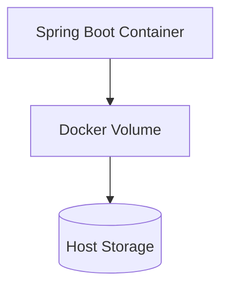
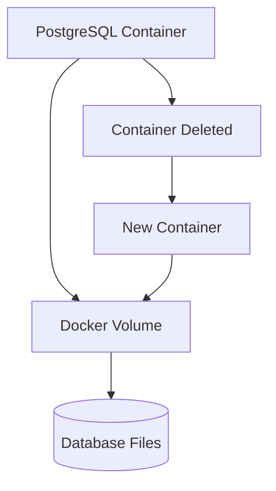
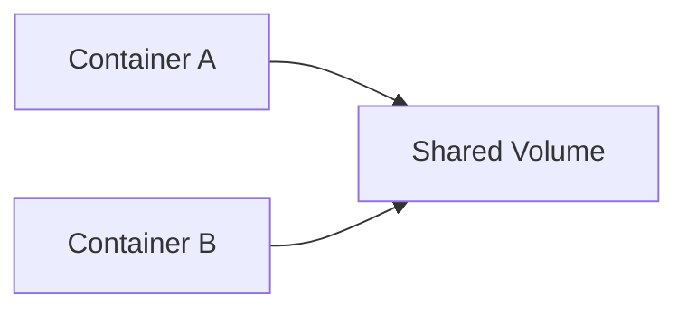

# Volumes

## Overview

Containers are designed to be **ephemeral**, meaning they can be created, stopped, removed, and recreated at any time.

However, applications such as PostgreSQL, MySQL, MongoDB, Redis, Elasticsearch, and even Spring Boot log files require **persistent storage**.

Docker **Volumes** solve this problem by storing data outside the container's writable layer.

This ensures that important data survives container deletion and recreation.

---

# Why Do We Need Volumes?

Without Volumes

```text
PostgreSQL Container

↓

Database Created

↓

Container Deleted

↓

Database Lost ❌
```

Every time the container is recreated,

all data disappears.

---

With Volumes

```text
PostgreSQL Container

↓

Docker Volume

↓

Persistent Storage

↓

Container Deleted

↓

Data Still Exists ✅
```

Volumes decouple application data from container lifecycle.

---

# What is a Docker Volume?

A Docker Volume is a managed storage location maintained by Docker.

Instead of storing data inside the container,

Docker stores it externally.

```text
Container

↓

Docker Volume

↓

Host Storage
```

The application continues reading and writing data normally.

---

# Volume Architecture

```text
Spring Boot

↓

Container

↓

Docker Volume

↓

Host Machine
```

Even if the container is removed,

the volume remains.

---

# Why Containers Lose Data

Every container has its own writable layer.

```text
Docker Image

↓

Container

↓

Writable Layer
```

When the container is removed,

the writable layer is removed as well.

Volumes prevent this data loss.

---

# Volume Types

Docker supports three storage mechanisms.

## Named Volume

Managed by Docker.

Example

```bash
docker volume create postgres-data
```

Recommended for production.

---

## Bind Mount

Maps a local directory.

Example

```bash
-v C:\logs:/logs
```

Useful during development.

---

## Anonymous Volume

Docker creates the volume automatically.

Example

```bash
-v /var/lib/postgresql/data
```

Difficult to manage.

Generally avoided in production.

---

# Named Volume

Example

```yaml
volumes:

  postgres-data:
```

Usage

```yaml
services:

  postgres:

    volumes:

      - postgres-data:/var/lib/postgresql/data
```

Docker manages everything.

---

# Bind Mount

Example

```yaml
volumes:

  - ./logs:/app/logs
```

Flow

```text
Host Folder

↓

Container Folder
```

Useful for

- Logs
- Configuration
- Development

---

# Anonymous Volume

Docker automatically creates

```text
Volume

↓

Random Name

↓

Container
```

Useful for temporary storage,

but difficult to manage later.

---

# Volume Lifecycle

```text
Create Volume

↓

Attach Container

↓

Read / Write Data

↓

Container Removed

↓

Volume Still Exists

↓

Attach New Container

↓

Data Available
```

---

# Spring Boot Example

Application

```text
Spring Boot

↓

logs/

↓

Docker Volume

↓

Persistent Logs
```

Logs remain available after container recreation.

---

# PostgreSQL Example

Without Volume

```text
PostgreSQL

↓

Patient Table

↓

Container Removed

↓

Database Lost
```

---

With Volume

```text
PostgreSQL

↓

Docker Volume

↓

Container Removed

↓

New Container

↓

Database Restored
```

Perfect for production systems.

---

# Docker Compose Example

```yaml
version: "3.9"

services:

  postgres:

    image: postgres:17

    volumes:

      - postgres-data:/var/lib/postgresql/data

volumes:

  postgres-data:
```

Docker automatically creates the volume.

---

# Volume Commands

Create Volume

```bash
docker volume create postgres-data
```

---

List Volumes

```bash
docker volume ls
```

---

Inspect Volume

```bash
docker volume inspect postgres-data
```

---

Remove Volume

```bash
docker volume rm postgres-data
```

---

Remove Unused Volumes

```bash
docker volume prune
```

---

# Sharing Volumes

Multiple containers can share the same volume.

```text
Container A

↓

Shared Volume

↑

Container B
```

Useful for

- Shared Files
- Logs
- Backups

---

# Volume vs Container Storage

| Container Storage | Docker Volume |
|-------------------|---------------|
| Temporary | Persistent |
| Deleted with Container | Survives Container |
| Writable Layer | External Storage |
| Poor for Databases | Ideal for Databases |

---

# Volume Use Cases

Docker Volumes are commonly used for:

- PostgreSQL
- MySQL
- MongoDB
- Redis Persistence
- Spring Boot Logs
- File Uploads
- Elasticsearch Data
- Backup Storage

---

# Telemedicine HMS Example

```text
Patient Service

↓

PostgreSQL Container

↓

Docker Volume

↓

Patient Records
```

Even if the PostgreSQL container crashes,

patient records remain safe.

---

# Backup Strategy

Production systems periodically back up Docker Volumes.

Example

```text
Docker Volume

↓

Backup Job

↓

Cloud Storage

↓

Disaster Recovery
```

Volumes simplify backup operations.

---

# Volume Best Practices

✅ Use Named Volumes for databases.

---

✅ Store uploaded files in volumes.

---

✅ Backup production volumes regularly.

---

✅ Keep application code outside volumes.

---

✅ Separate database and log volumes.

---

# Common Mistakes

❌ Running databases without volumes.

---

❌ Deleting production volumes accidentally.

---

❌ Storing secrets inside shared volumes.

---

❌ Using bind mounts in production without planning.

---

❌ Assuming container storage is persistent.

---

# Real-World Usage

Docker Volumes are essential for:

- PostgreSQL Databases
- MySQL Databases
- MongoDB
- Redis Persistence
- Jenkins
- SonarQube
- Nexus Repository
- Elasticsearch
- Spring Boot Applications

Every production database should use persistent volumes.

---

# Mermaid Diagram — Volume Architecture



---

# Mermaid Diagram — PostgreSQL Persistence



---

# Mermaid Diagram — Shared Volume



---

# Interview Notes

Frequently asked questions:

- What is a Docker Volume?
- Why do containers lose data?
- Why are Volumes required for databases?
- Difference between Named Volumes and Bind Mounts?
- What are Anonymous Volumes?
- Can multiple containers share a Volume?
- What happens to a Volume after a container is deleted?
- How do you inspect Docker Volumes?
- How do production systems back up Volumes?
- Why should PostgreSQL always use a Docker Volume?

---

# Key Takeaways

- Docker Volumes provide persistent storage independent of container lifecycle.
- Databases should always use Named Volumes to prevent data loss.
- Bind Mounts are useful during development, while Named Volumes are preferred for production.
- Volumes survive container deletion and can be reused by new containers.
- Proper volume management is essential for backups, disaster recovery, and production-grade containerized applications.