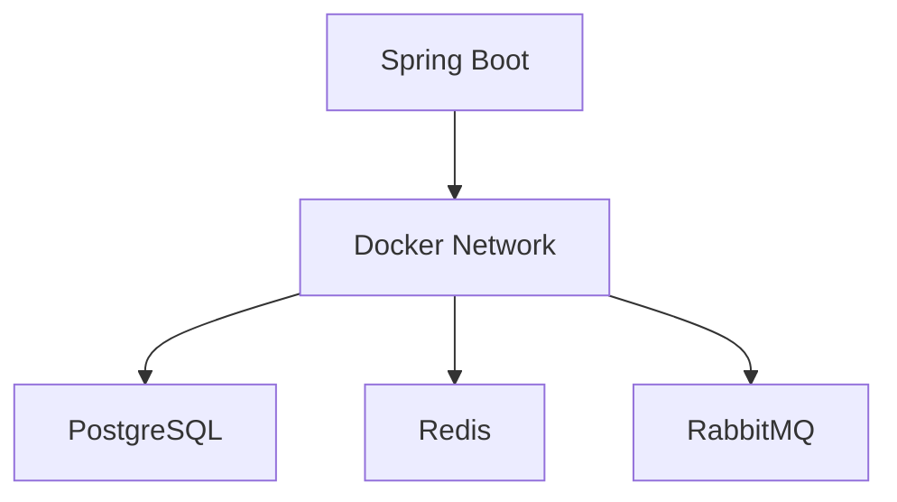
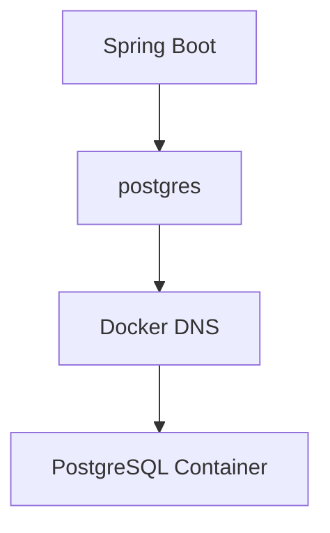
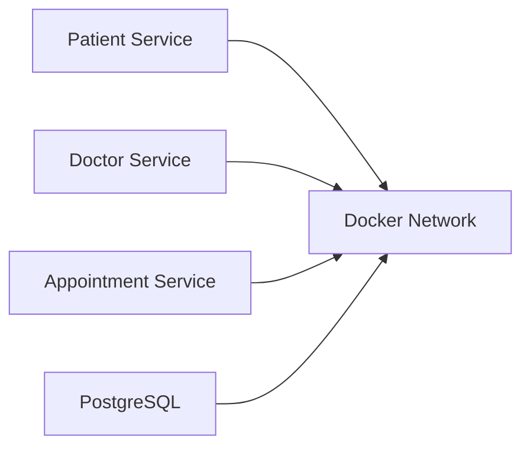

# Docker Networks

## Overview

Containers are isolated from one another by default.

If multiple containers need to communicate—for example, a Spring Boot application connecting to PostgreSQL—they require a **Docker Network**.

Docker Networks enable secure and efficient communication between containers without exposing every service to the outside world.

Networking is one of Docker's most powerful features and is heavily used in microservice architectures.

---

# Why Docker Networks?

Imagine a Spring Boot application running inside one container.

PostgreSQL runs inside another.

Without networking

```text
Spring Boot

↓

???

↓

PostgreSQL
```

The application cannot locate the database.

---

With Docker Network

```text
Spring Boot

↓

Docker Network

↓

PostgreSQL
```

Containers communicate using service names.

---

# Docker Network Architecture

```text
             Docker Network

     ----------------------------

     Spring Boot Container

              |

              |

      PostgreSQL Container

              |

              |

        Redis Container

     ----------------------------
```

Every container inside the same network can communicate.

---

# Default Docker Networks

Docker creates three default networks.

```text
bridge

host

none
```

---

## Bridge Network

Default network.

```text
Container A

↓

Bridge Network

↓

Container B
```

Most Docker applications use Bridge networks.

---

## Host Network

Container shares the host's network.

```text
Container

↓

Host Network
```

Useful for performance-sensitive applications.

Available mainly on Linux.

---

## None Network

```text
Container

↓

No Network
```

The container has no network connectivity.

Used for highly isolated workloads.

---

# Custom Bridge Network

Production applications should create custom networks.

Example

```bash
docker network create hms-network
```

Benefits

- Better isolation
- Automatic DNS
- Easier management
- Cleaner architecture

---

# Docker DNS

Docker automatically provides DNS resolution.

Instead of

```text
192.168.1.10
```

containers can communicate using

```text
postgres
```

Example

```properties
spring.datasource.url=

jdbc:postgresql://postgres:5432/hms
```

Notice

```text
postgres
```

is the container name.

---

# Communication Flow

```text
Spring Boot

↓

postgres

↓

Docker DNS

↓

PostgreSQL Container
```

No IP addresses are required.

---

# Network Lifecycle

```text
Create Network

↓

Attach Containers

↓

Container Communication

↓

Remove Containers

↓

Network Remains

↓

Reuse Network
```

---

# Creating Network

```bash
docker network create hms-network
```

---

# Listing Networks

```bash
docker network ls
```

Example

```text
NETWORK ID

NAME

DRIVER
```

---

# Inspect Network

```bash
docker network inspect hms-network
```

Displays

- Connected Containers
- Subnet
- Gateway
- Driver

---

# Remove Network

```bash
docker network rm hms-network
```

Network must not contain active containers.

---

# Connecting Container

```bash
docker run

--network hms-network

springboot-demo
```

Container joins the network.

---

# Docker Compose Networking

Compose automatically creates a network.

Example

```yaml
services:

  app:

    image: springboot-demo

  postgres:

    image: postgres
```

Docker Compose creates

```text
project_default
```

Both services automatically join this network.

---

# Container Communication

Suppose

```yaml
services:

  app

  postgres
```

Spring Boot connects using

```properties
jdbc:postgresql://postgres:5432/hms
```

NOT

```text
localhost
```

Inside containers,

```text
localhost

≠

Other Container
```

---

# Telemedicine HMS Example

```text
Patient Service

↓

Docker Network

↓

PostgreSQL

↓

Docker Network

↓

Redis

↓

Docker Network

↓

Notification Service
```

Every service communicates securely.

---

# Network Drivers

Docker supports multiple drivers.

| Driver | Purpose |
|---------|----------|
| Bridge | Default networking |
| Host | Host networking |
| None | No networking |
| Overlay | Multi-host networking |
| Macvlan | Physical network integration |

Bridge is the most common.

---

# Security Benefits

Networks provide

- Isolation
- Service Discovery
- Internal Communication
- Reduced External Exposure

Only required ports should be published externally.

---

# Production Networking

Typical architecture

```text
Internet

↓

NGINX

↓

Docker Network

↓

API Gateway

↓

Patient Service

↓

Doctor Service

↓

Appointment Service

↓

PostgreSQL
```

Internal services remain hidden.

---

# Best Practices

✅ Use custom bridge networks.

---

✅ Use container names instead of IP addresses.

---

✅ Keep databases on internal networks.

---

✅ Publish only necessary ports.

---

✅ Let Docker DNS resolve services.

---

# Common Mistakes

❌ Using localhost between containers.

---

❌ Hardcoding container IP addresses.

---

❌ Exposing databases publicly.

---

❌ Putting every service on the same public network.

---

❌ Ignoring network isolation.

---

# Real-World Usage

Docker Networks are essential for:

- Spring Boot Microservices
- PostgreSQL
- Redis
- RabbitMQ
- Kafka
- Elasticsearch
- API Gateways

Every modern containerized backend relies on Docker networking.

---

# Mermaid Diagram — Docker Network



---

# Mermaid Diagram — Docker DNS



---

# Mermaid Diagram — HMS Network



---

# Interview Notes

Frequently asked questions:

- What is a Docker Network?
- Why do containers need networking?
- What is the default Docker network?
- Difference between Bridge and Host networks?
- Why shouldn't containers use localhost?
- How does Docker DNS work?
- What network does Docker Compose create?
- What are Overlay networks?
- Why create custom Bridge networks?
- How do microservices communicate inside Docker?

---

# Key Takeaways

- Docker Networks allow isolated containers to communicate securely.
- Bridge networks are the default networking mechanism for most Docker applications.
- Docker DNS enables communication using container or service names instead of IP addresses.
- Docker Compose automatically creates a shared network for services.
- Proper network design improves security, scalability, and maintainability in containerized applications.