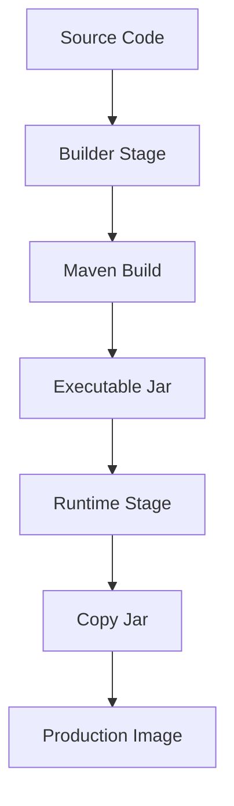
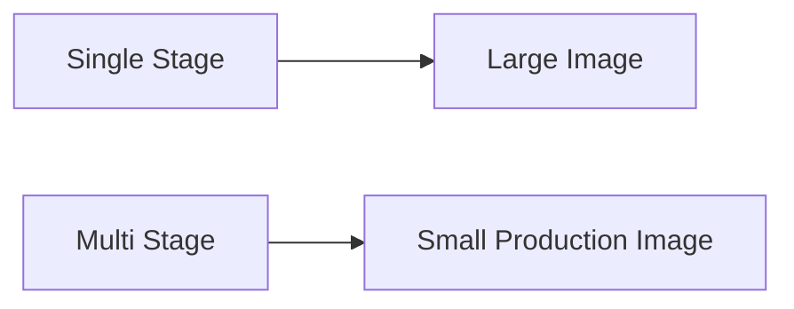

# Multi-Stage Builds

## Overview

One of the biggest mistakes beginners make when containerizing Spring Boot applications is using a **single-stage Docker build**.

A single-stage build includes:

- Source Code
- Maven
- JDK
- Build Dependencies
- Final JAR

inside one Docker image.

The result is a very large image that takes longer to build, push, pull, and deploy.

**Multi-stage builds** solve this problem by separating the **build environment** from the **runtime environment**.

This is the recommended approach for production Docker images.

---

# Why Multi-Stage Builds?

Without Multi-Stage Build

```text
Source Code

↓

Maven

↓

JDK

↓

Dependencies

↓

Jar

↓

Large Docker Image
```

The final image contains unnecessary build tools.

---

With Multi-Stage Build

```text
Build Stage

↓

Create Jar

↓

Copy Jar

↓

Runtime Stage

↓

Small Docker Image
```

Only the application and runtime remain.

---

# Problem with Single-Stage Builds

Example

```dockerfile
FROM eclipse-temurin:21-jdk

COPY . .

RUN mvn clean package

CMD ["java","-jar","target/app.jar"]
```

This image contains

- Maven
- Source Code
- Target Folder
- Cache
- JDK

Even though only the JAR is needed.

---

# Multi-Stage Architecture

```text
               Stage 1

         Maven + JDK

              ↓

        Build Spring Boot

              ↓

         target/app.jar

              ↓

               Stage 2

          JRE / JDK Runtime

              ↓

          Copy app.jar

              ↓

        Production Image
```

---

# Stage 1 — Builder

Builder Stage

```dockerfile
FROM maven:3.9.9-eclipse-temurin-21 AS builder
```

Purpose

- Compile source code
- Download dependencies
- Build executable JAR

---

# Build Application

```dockerfile
WORKDIR /app

COPY . .

RUN mvn clean package -DskipTests
```

Output

```text
target/demo.jar
```

---

# Stage 2 — Runtime

```dockerfile
FROM eclipse-temurin:21-jre
```

Notice

```text
JRE

NOT

JDK
```

The application only needs the Java Runtime.

---

# Copy Built JAR

```dockerfile
COPY --from=builder \
     /app/target/demo.jar \
     app.jar
```

Docker copies only

```text
demo.jar
```

Nothing else.

---

# Start Application

```dockerfile
ENTRYPOINT

["java","-jar","app.jar"]
```

Container Startup

```text
Container

↓

Java Runtime

↓

Spring Boot

↓

Application Running
```

---

# Complete Multi-Stage Dockerfile

```dockerfile
# Stage 1

FROM maven:3.9.9-eclipse-temurin-21 AS builder

WORKDIR /app

COPY . .

RUN mvn clean package -DskipTests

# Stage 2

FROM eclipse-temurin:21-jre

WORKDIR /app

COPY --from=builder /app/target/*.jar app.jar

EXPOSE 8080

ENTRYPOINT ["java","-jar","app.jar"]
```

This is the recommended production structure.

---

# Build Process

```text
Docker Build

↓

Stage 1

↓

Compile Project

↓

Build Jar

↓

Stage 2

↓

Copy Jar

↓

Final Image
```

---

# Image Comparison

Single Stage

```text
JDK

+

Maven

+

Source Code

+

Jar

↓

700 MB
```

---

Multi Stage

```text
JRE

+

Jar

↓

200 MB
```

Much smaller image.

---

# Why Smaller Images?

Smaller images provide:

- Faster builds
- Faster deployment
- Faster downloads
- Less storage
- Lower attack surface

---

# Security Benefits

Builder

```text
Maven

JDK

Compiler

```

Runtime

```text
JRE

Jar
```

Attackers cannot exploit tools that are not present.

---

# Docker Cache

Docker caches

```dockerfile
COPY pom.xml .

RUN mvn dependency:go-offline
```

Dependencies remain cached.

Only source code rebuilds.

This significantly speeds up builds.

---

# Optimized Build Example

```dockerfile
COPY pom.xml .

RUN mvn dependency:go-offline

COPY src src

RUN mvn clean package
```

Benefits

- Faster incremental builds
- Better Docker cache utilization

---

# Runtime Image

Production runtime images should contain only:

```text
Operating System

↓

Java Runtime

↓

Application

↓

Configuration
```

Nothing else.

---

# Builder vs Runtime

| Builder | Runtime |
|----------|----------|
| Maven | JRE |
| JDK | Runtime |
| Source Code | JAR |
| Dependencies | Application |
| Build Tools | Production Only |

---

# Build Command

```bash
docker build -t springboot-demo .
```

Docker automatically executes both stages.

---

# Run Command

```bash
docker run -p 8080:8080 springboot-demo
```

Application starts from the runtime image.

---

# Spring Boot Production Flow

```text
Developer

↓

Git Push

↓

CI Pipeline

↓

Docker Build

↓

Multi-Stage Build

↓

Docker Image

↓

Docker Registry

↓

Production Server

↓

Container Running
```

---

# Why Use JRE Instead of JDK?

The application has already been compiled.

It only needs

```text
Java Runtime
```

Removing the JDK reduces:

- Image Size
- Memory Usage
- Attack Surface

---

# Best Practices

✅ Always use Multi-Stage Builds.

---

✅ Separate Builder and Runtime stages.

---

✅ Use JRE for runtime.

---

✅ Skip tests during Docker builds if CI already executed them.

---

✅ Copy only the executable JAR.

---

✅ Keep runtime images minimal.

---

# Common Mistakes

❌ Using Maven inside production images.

---

❌ Shipping source code.

---

❌ Installing unnecessary packages.

---

❌ Using the JDK when only the JRE is required.

---

❌ Building everything inside one stage.

---

# Real-World Usage

Multi-stage builds are widely used by:

- Netflix
- Amazon
- Uber
- Spotify
- Red Hat
- Google
- Microsoft

Every production Spring Boot project should use multi-stage builds.

---

# Mermaid Diagram — Multi-Stage Build



---

# Mermaid Diagram — Image Optimization



---

# Interview Notes

Frequently asked questions:

- What is a Multi-Stage Build?
- Why use Multi-Stage Builds?
- Difference between Builder and Runtime stages?
- Why use JRE instead of JDK?
- Why are Multi-Stage Builds more secure?
- How do Multi-Stage Builds reduce image size?
- What does `COPY --from=builder` do?
- How does Docker layer caching improve builds?
- Why should Maven not exist in production images?
- How would you optimize a Spring Boot Docker image?

---

# Key Takeaways

- Multi-stage builds separate the build environment from the runtime environment.
- The builder stage compiles the application, while the runtime stage contains only the executable JAR and Java Runtime.
- Multi-stage builds significantly reduce image size, improve security, and accelerate deployments.
- Production images should never contain source code or unnecessary build tools.
- This approach is considered the industry standard for containerizing Spring Boot applications.