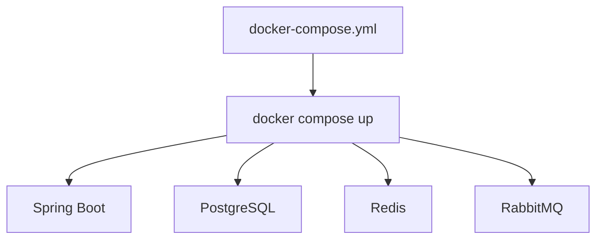
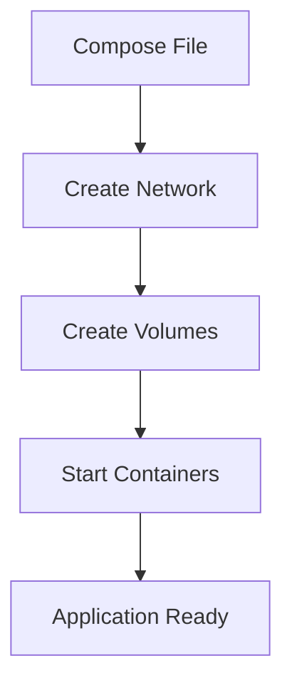

# Docker Compose

## Overview

Modern applications rarely consist of a single container.

A typical Spring Boot application depends on multiple services such as:

- PostgreSQL
- Redis
- RabbitMQ
- Kafka
- Elasticsearch

Managing each container individually using `docker run` quickly becomes difficult.

**Docker Compose** solves this problem by allowing multiple containers to be defined and managed using a single YAML configuration file.

With Docker Compose, an entire application stack can be started with a single command.

```bash
docker compose up
```

---

# Why Docker Compose?

Without Docker Compose

```text
Start PostgreSQL

↓

Start Redis

↓

Start RabbitMQ

↓

Start Spring Boot

↓

Connect Networks

↓

Create Volumes

↓

Configure Environment Variables

↓

Run Application
```

Many manual steps.

---

With Docker Compose

```text
docker compose up

↓

Everything Starts Automatically
```

---

# Docker Compose Architecture

```text
docker-compose.yml

↓

Docker Compose

↓

Spring Boot

↓

PostgreSQL

↓

Redis

↓

RabbitMQ

↓

Docker Network

↓

Docker Volumes
```

Compose manages the entire application stack.

---

# What is docker-compose.yml?

The `docker-compose.yml` file describes:

- Services
- Images
- Containers
- Networks
- Volumes
- Environment Variables
- Ports
- Health Checks

It acts as the blueprint for running multiple containers together.

---

# Docker Compose Workflow

```text
docker-compose.yml

↓

docker compose up

↓

Build Images

↓

Create Network

↓

Create Volumes

↓

Start Containers

↓

Application Running
```

---

# Basic Docker Compose File

```yaml
version: "3.9"

services:

  app:

    image: springboot-demo

  postgres:

    image: postgres:17
```

This creates two containers.

---

# Spring Boot + PostgreSQL Example

```yaml
version: "3.9"

services:

  app:

    build: .

    ports:

      - "8080:8080"

    depends_on:

      - postgres

  postgres:

    image: postgres:17

    ports:

      - "5432:5432"

    environment:

      POSTGRES_DB: hms

      POSTGRES_USER: postgres

      POSTGRES_PASSWORD: password
```

One command starts both services.

---

# Services

Every container is defined as a service.

Example

```yaml
services:

  app:

  postgres:

  redis:

  rabbitmq:
```

Each service becomes its own container.

---

# Build vs Image

Using an existing image

```yaml
image: postgres:17
```

Building locally

```yaml
build: .
```

Use

```text
image
```

for published images.

Use

```text
build
```

for local projects.

---

# Port Mapping

Example

```yaml
ports:

  - "8080:8080"
```

Meaning

```text
Host Port

↓

8080

↓

Container Port

↓

8080
```

---

# Environment Variables

Example

```yaml
environment:

  SPRING_PROFILES_ACTIVE: docker

  DB_HOST: postgres

  DB_PORT: 5432
```

Compose injects these variables into the container.

---

# Volumes

Example

```yaml
volumes:

  - postgres-data:/var/lib/postgresql/data
```

Database survives container recreation.

---

# Networks

Compose automatically creates

```text
project_default
```

Every service joins this network.

Services communicate using

```text
postgres

redis

rabbitmq
```

instead of IP addresses.

---

# depends_on

Example

```yaml
depends_on:

  - postgres
```

Spring Boot starts after PostgreSQL starts.

Important:

`depends_on` controls startup order but **does not guarantee that PostgreSQL is fully ready to accept connections**. Health checks are typically added for production readiness.

---

# Docker Compose Lifecycle

```text
docker compose up

↓

Network Created

↓

Volumes Created

↓

Containers Started

↓

Application Running
```

---

# Stop Containers

```bash
docker compose stop
```

Containers stop.

Volumes remain.

---

# Start Again

```bash
docker compose start
```

Previously created containers start again.

---

# Remove Containers

```bash
docker compose down
```

Containers

↓

Networks

↓

Removed

Volumes remain.

---

# Remove Everything

```bash
docker compose down -v
```

Removes

- Containers
- Networks
- Volumes

Use carefully.

---

# Viewing Running Containers

```bash
docker compose ps
```

Displays

- Service Name
- Status
- Ports

---

# Viewing Logs

```bash
docker compose logs
```

Specific service

```bash
docker compose logs app
```

Useful for debugging.

---

# Rebuilding

Suppose source code changes.

```bash
docker compose up --build
```

Docker rebuilds the application image.

---

# Telemedicine HMS Example

```text
docker compose up

↓

Patient Service

↓

Doctor Service

↓

Appointment Service

↓

Notification Service

↓

API Gateway

↓

PostgreSQL

↓

Redis

↓

RabbitMQ
```

Entire platform starts automatically.

---

# Production Workflow

```text
Git Pull

↓

docker compose pull

↓

docker compose up -d

↓

Application Running
```

Simple deployment.

---

# Advantages

Docker Compose provides

- Multi-container management
- Automatic networking
- Volume management
- Environment variables
- Repeatable deployments
- Easier development

---

# Best Practices

✅ Use one Compose file per application.

---

✅ Keep secrets outside Compose files.

---

✅ Use named volumes.

---

✅ Define explicit image versions.

---

✅ Use health checks for dependent services.

---

# Common Mistakes

❌ Using `latest` image tags.

---

❌ Hardcoding passwords.

---

❌ Ignoring volumes.

---

❌ Using localhost between services.

---

❌ Assuming `depends_on` waits for application readiness.

---

# Real-World Usage

Docker Compose is commonly used for

- Spring Boot Development
- Local Microservice Testing
- CI Pipelines
- Integration Testing
- QA Environments
- Small Production Deployments

Larger production environments often use Kubernetes, but Docker Compose remains an excellent development and learning tool.

---

# Mermaid Diagram — Docker Compose



---

# Mermaid Diagram — Compose Workflow



---

# Interview Notes

Frequently asked questions:

- What is Docker Compose?
- Why use Docker Compose?
- Difference between `image` and `build`?
- What does `depends_on` do?
- Does `depends_on` wait until a database is ready?
- How are services connected in Docker Compose?
- What happens when `docker compose down` is executed?
- Difference between `down` and `down -v`?
- Why are named volumes important?
- When would you choose Docker Compose over manually running containers?

---

# Key Takeaways

- Docker Compose simplifies running multi-container applications using a single YAML file.
- It automatically manages containers, networks, and volumes.
- Services communicate using service names through Docker's built-in DNS.
- `depends_on` controls startup order but should be combined with health checks for production readiness.
- Docker Compose provides a consistent, repeatable environment for development, testing, and small-scale deployments.