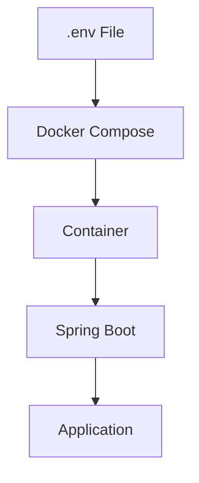
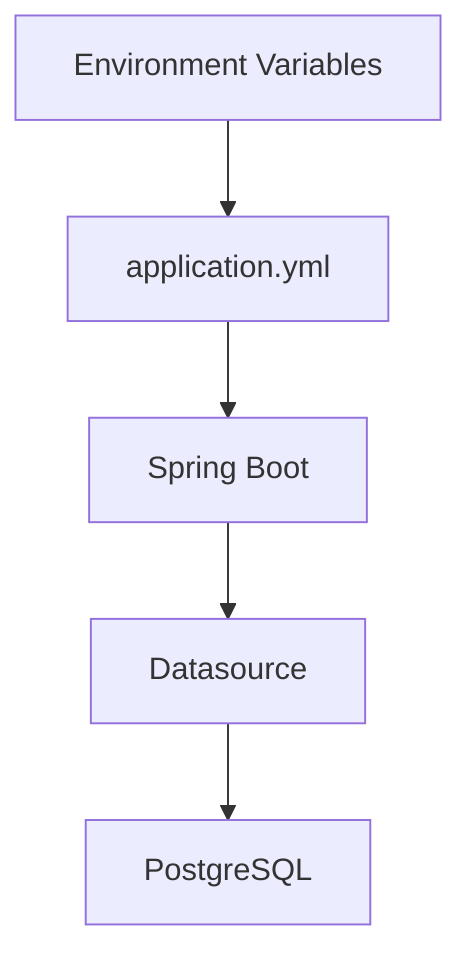

# Environment Variables

## Overview

Applications require configuration to run correctly.

Examples include:

- Database URL
- Database Username
- Database Password
- JWT Secret
- API Keys
- Active Spring Profile

Hardcoding these values inside source code or Docker images is insecure and inflexible.

Docker uses **Environment Variables** to inject configuration into containers at runtime.

This allows the same Docker image to run in different environments (Development, Testing, Staging, Production) without rebuilding the image.

---

# Why Environment Variables?

Without Environment Variables

```text
Application

↓

Hardcoded Database URL

↓

Hardcoded Password

↓

Hardcoded JWT Secret
```

Problems

- Not secure
- Difficult to change
- Different code for different environments
- Secrets stored in Git

---

With Environment Variables

```text
Application

↓

Environment Variables

↓

Runtime Configuration
```

The same image can run anywhere.

---

# Configuration Architecture

```text
Docker Image

↓

Environment Variables

↓

Spring Boot

↓

Application Configuration
```

Docker provides configuration.

Spring Boot consumes it.

---

# Docker ENV Instruction

Dockerfile supports

```dockerfile
ENV
```

Example

```dockerfile
ENV APP_NAME=Telemedicine HMS
```

Now the container contains

```text
APP_NAME

↓

Telemedicine HMS
```

---

# Multiple Environment Variables

Example

```dockerfile
ENV SPRING_PROFILES_ACTIVE=docker

ENV SERVER_PORT=8080
```

These become available inside the running container.

---

# Docker Run Example

Environment variables can also be supplied during execution.

```bash
docker run \
-e DB_HOST=postgres \
-e DB_PORT=5432 \
springboot-demo
```

No Dockerfile modification is required.

---

# Docker Compose Example

Most production applications define environment variables inside

```text
docker-compose.yml
```

Example

```yaml
services:

  app:

    environment:

      SPRING_PROFILES_ACTIVE: docker

      DB_HOST: postgres

      DB_PORT: 5432

      DB_NAME: hms

      DB_USERNAME: postgres

      DB_PASSWORD: password
```

Compose injects these values into the application.

---

# Spring Boot Configuration

Spring Boot reads environment variables automatically.

Example

```yaml
spring:

  datasource:

    url: jdbc:postgresql://${DB_HOST}:${DB_PORT}/${DB_NAME}

    username: ${DB_USERNAME}

    password: ${DB_PASSWORD}
```

No values are hardcoded.

---

# Application Flow

```text
Docker Compose

↓

Environment Variables

↓

Spring Boot

↓

Datasource Configuration

↓

PostgreSQL Connection
```

---

# .env File

Instead of placing variables directly inside

```yaml
docker-compose.yml
```

Docker Compose supports

```text
.env
```

Example

```text
DB_HOST=postgres

DB_PORT=5432

DB_NAME=hms

DB_USERNAME=postgres

DB_PASSWORD=password
```

Compose automatically loads this file.

---

# Compose Using .env

Example

```yaml
environment:

  DB_HOST: ${DB_HOST}

  DB_PORT: ${DB_PORT}

  DB_NAME: ${DB_NAME}

  DB_USERNAME: ${DB_USERNAME}

  DB_PASSWORD: ${DB_PASSWORD}
```

This keeps configuration separate from infrastructure.

---

# Environment Separation

Development

```text
DB_HOST=localhost
```

Testing

```text
DB_HOST=test-db
```

Production

```text
DB_HOST=prod-db
```

Same Docker image.

Different runtime configuration.

---

# Spring Profiles

Example

```text
Development

↓

application-dev.yml
```

Production

```text
application-prod.yml
```

Docker

```text
SPRING_PROFILES_ACTIVE=docker
```

Spring Boot automatically loads the correct configuration.

---

# JWT Secret

Never write

```yaml
jwt:

  secret: my-secret-key
```

Instead

```yaml
jwt:

  secret: ${JWT_SECRET}
```

Docker provides

```text
JWT_SECRET
```

at runtime.

---

# API Keys

Incorrect

```java
private static final String API_KEY =
        "abcd123";
```

Correct

```text
API_KEY

↓

Environment Variable
```

Secrets never appear in source code.

---

# Why Not Hardcode Secrets?

Suppose your GitHub repository becomes public.

Hardcoded

```text
Database Password

JWT Secret

API Keys
```

are immediately exposed.

Environment variables prevent this.

---

# Twelve-Factor App

Modern cloud-native applications follow the

**Twelve-Factor App**

recommendation

> Store configuration in the environment.

Benefits

- Portability
- Security
- Cloud compatibility

---

# Docker Secrets

For highly sensitive production data,

Docker also supports

```text
Docker Secrets
```

Used for

- Database Passwords
- Certificates
- API Tokens
- Encryption Keys

More secure than plain environment variables.

---

# Environment Variable Flow

```text
.env

↓

Docker Compose

↓

Container

↓

Spring Boot

↓

Application
```

---

# Telemedicine HMS Example

```text
Patient Service

↓

Environment Variables

↓

Database URL

↓

PostgreSQL

↓

Connected
```

Every microservice receives its own configuration.

---

# Best Practices

✅ Keep secrets outside source code.

---

✅ Use `.env` for local development.

---

✅ Use environment variables in Docker Compose.

---

✅ Use Spring Profiles for environment-specific configuration.

---

✅ Rotate secrets regularly.

---

# Common Mistakes

❌ Hardcoding passwords.

---

❌ Hardcoding JWT secrets.

---

❌ Committing `.env` files containing production secrets.

---

❌ Using the same configuration for every environment.

---

❌ Storing API keys inside Docker images.

---

# Real-World Usage

Environment variables are used for:

- Database Credentials
- JWT Secrets
- Redis Configuration
- Kafka Brokers
- RabbitMQ Credentials
- API Keys
- Cloud Storage Configuration
- Logging Levels

Every production containerized application relies on environment-based configuration.

---

# Mermaid Diagram — Configuration Flow



---

# Mermaid Diagram — Spring Boot Configuration



---

# Interview Notes

Frequently asked questions:

- What are environment variables?
- Why should configuration not be hardcoded?
- How does Docker pass environment variables?
- What is a `.env` file?
- How does Spring Boot read environment variables?
- Why should JWT secrets be environment variables?
- What is the Twelve-Factor App principle?
- Difference between `.env` and Docker Secrets?
- Why use Spring Profiles with Docker?
- How do you manage configuration across environments?

---

# Key Takeaways

- Environment variables provide runtime configuration without modifying application code.
- Docker and Docker Compose make it easy to inject configuration into containers.
- Spring Boot automatically maps environment variables into application configuration.
- Sensitive values such as passwords, JWT secrets, and API keys should never be hardcoded.
- Following the Twelve-Factor App methodology improves portability, security, and maintainability across development, testing, and production environments.