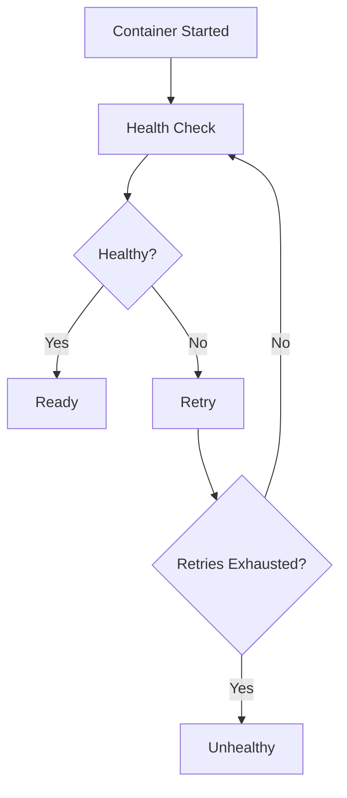
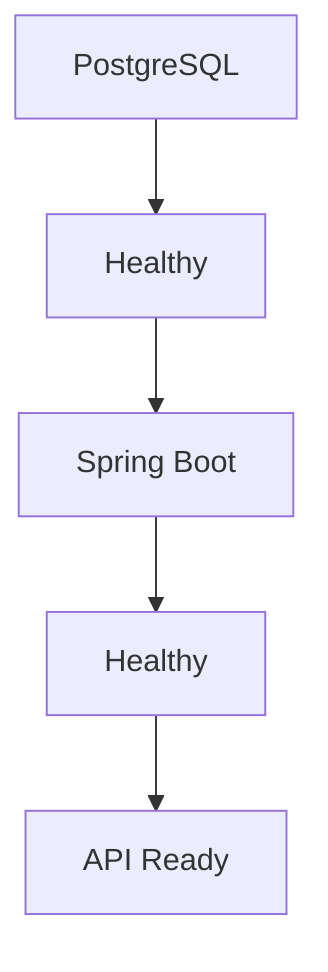

# Health Checks

## Overview

Starting a container does **not** necessarily mean the application inside it is ready to accept requests.

For example:

- Spring Boot may still be starting.
- PostgreSQL may still be initializing.
- Redis may still be loading data.

Docker **Health Checks** allow Docker to continuously verify whether a container is actually healthy and ready to serve traffic.

Health checks are essential for production deployments because they improve reliability, orchestration, and service startup coordination.

---

# Why Health Checks?

Without Health Checks

```text
Docker Starts Container

↓

Container Running

↓

Spring Boot Still Starting

↓

Request Arrives

↓

Connection Failed
```

Docker believes the container is running.

The application is not yet ready.

---

With Health Checks

```text
Docker Starts Container

↓

Health Check

↓

Application Ready

↓

Healthy

↓

Accept Requests
```

Only healthy containers are considered ready.

---

# Container States

Docker containers have multiple states.

```text
Created

↓

Running

↓

Healthy

↓

Unhealthy

↓

Stopped
```

Health status is separate from the running state.

---

# Running vs Healthy

Running

```text
Container Process Exists
```

Healthy

```text
Application Ready

↓

Accepting Requests
```

A container can be **running but unhealthy**.

---

# Spring Boot Example

Suppose a Spring Boot application requires

- Database Connection
- Bean Initialization
- Cache Loading

Startup may take

```text
20 Seconds
```

Without a health check,

requests during startup may fail.

---

# Spring Boot Actuator

Health Checks are commonly implemented using

Spring Boot Actuator.

Dependency

```xml
<dependency>

    <groupId>

        org.springframework.boot

    </groupId>

    <artifactId>

        spring-boot-starter-actuator

    </artifactId>

</dependency>
```

---

# Health Endpoint

Actuator exposes

```text
/actuator/health
```

Example

```json
{
  "status": "UP"
}
```

Docker checks this endpoint.

---

# Dockerfile Health Check

Example

```dockerfile
HEALTHCHECK \
--interval=30s \
--timeout=5s \
--retries=3 \
CMD curl -f http://localhost:8080/actuator/health || exit 1
```

Docker executes this command periodically.

---

# HEALTHCHECK Parameters

### Interval

```text
30 Seconds
```

Time between health checks.

---

### Timeout

```text
5 Seconds
```

Maximum time Docker waits.

---

### Retries

```text
3
```

Number of failures before marking

```text
Unhealthy
```

---

# Health Check Flow

```text
Container

↓

Execute Command

↓

Success?

↓

YES

↓

Healthy

-------------------

NO

↓

Retry

↓

Still Fails

↓

Unhealthy
```

---

# Docker Compose Health Check

Example

```yaml
services:

  app:

    healthcheck:

      test: ["CMD","curl","-f","http://localhost:8080/actuator/health"]

      interval: 30s

      timeout: 5s

      retries: 3
```

Compose automatically monitors the container.

---

# PostgreSQL Health Check

Example

```yaml
healthcheck:

  test:

    ["CMD-SHELL",

    "pg_isready -U postgres"]

  interval: 10s

  timeout: 5s

  retries: 5
```

Checks database readiness.

---

# Redis Health Check

Example

```yaml
healthcheck:

  test:

    ["CMD",

     "redis-cli",

     "ping"]
```

Expected response

```text
PONG
```

---

# RabbitMQ Health Check

Example

```yaml
healthcheck:

  test:

    ["CMD",

     "rabbitmq-diagnostics",

     "ping"]
```

Ensures broker availability.

---

# Compose with Health Checks

```text
Docker Compose

↓

Start PostgreSQL

↓

Healthy

↓

Start Spring Boot

↓

Healthy

↓

Application Ready
```

Health checks improve startup reliability.

---

# depends_on Limitation

Many developers believe

```yaml
depends_on:
```

waits until PostgreSQL is ready.

It does not.

It only controls startup order.

Correct approach

```text
depends_on

+

Health Check
```

---

# Monitoring Health

View health status

```bash
docker ps
```

Example

```text
STATUS

Up 30 seconds (healthy)
```

or

```text
Up 30 seconds (unhealthy)
```

---

# Inspect Health

```bash
docker inspect container-name
```

Displays

- Current Status
- Health History
- Failure Logs

Useful for debugging.

---

# Telemedicine HMS Example

```text
PostgreSQL

↓

Healthy

↓

Patient Service

↓

Healthy

↓

Doctor Service

↓

Healthy

↓

API Gateway

↓

Healthy
```

Entire platform becomes reliable.

---

# Failure Scenario

```text
Spring Boot

↓

Database Down

↓

Health Check

↓

Failed

↓

Unhealthy
```

Monitoring systems immediately detect the issue.

---

# Production Usage

Health checks integrate with

- Docker Compose
- Kubernetes
- AWS ECS
- Azure Container Apps
- Google Cloud Run
- Docker Swarm

Orchestrators automatically restart unhealthy containers.

---

# Best Practices

✅ Expose `/actuator/health`.

---

✅ Keep health checks lightweight.

---

✅ Use meaningful intervals.

---

✅ Combine health checks with `depends_on`.

---

✅ Monitor unhealthy containers.

---

# Common Mistakes

❌ Assuming "Running" means healthy.

---

❌ Using expensive health check operations.

---

❌ Ignoring failed health checks.

---

❌ Returning HTTP 200 when dependencies are unavailable.

---

❌ Forgetting to include Spring Boot Actuator.

---

# Real-World Usage

Health checks are critical for:

- Spring Boot APIs
- PostgreSQL
- Redis
- RabbitMQ
- Kafka
- Elasticsearch
- Kubernetes Deployments

Every production container platform relies on health checks.

---

# Mermaid Diagram — Health Check Flow



---

# Mermaid Diagram — HMS Startup



---

# Interview Notes

Frequently asked questions:

- What is a Docker Health Check?
- Difference between Running and Healthy?
- Why use Spring Boot Actuator?
- What does the `HEALTHCHECK` instruction do?
- Why doesn't `depends_on` guarantee readiness?
- How do you implement health checks in Docker Compose?
- How do you inspect container health?
- What happens when a container becomes unhealthy?
- Why are health checks important in Kubernetes?
- What endpoint is commonly used for Spring Boot health checks?

---

# Key Takeaways

- A running container is not necessarily a healthy container.
- Docker Health Checks continuously verify application readiness.
- Spring Boot Actuator provides a standard `/actuator/health` endpoint for health monitoring.
- Health checks improve startup reliability, monitoring, and orchestration.
- Combining health checks with Docker Compose and orchestration platforms results in more resilient, production-ready applications.