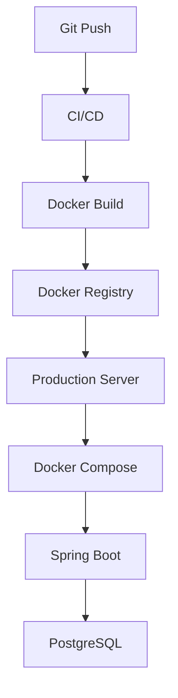
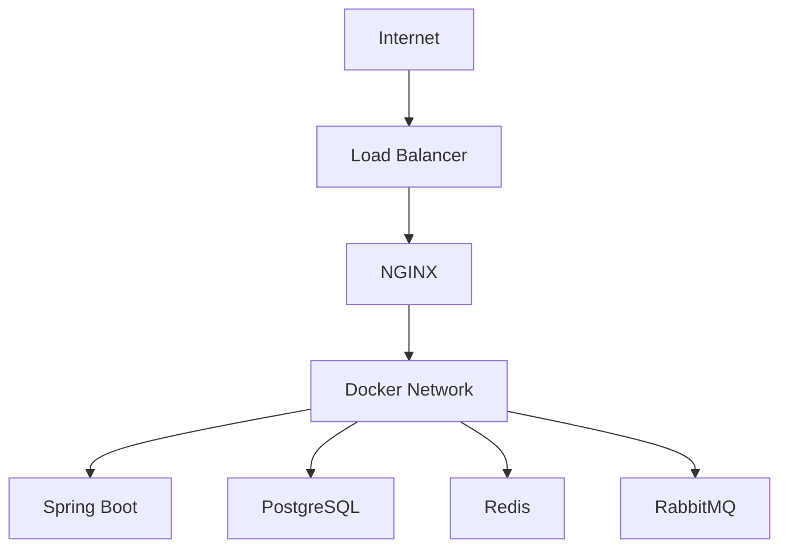

# Production Best Practices

## Overview

Writing a Dockerfile that successfully runs an application is only the beginning.

Production environments demand applications that are:

- Secure
- Reliable
- Scalable
- Maintainable
- Observable
- Efficient

This document summarizes the Docker best practices followed by modern backend engineering teams when deploying Spring Boot applications.

---

# Why Production Best Practices?

A development Docker image may work correctly.

However,

working locally

≠

production-ready.

Production environments require:

- Smaller Images
- Secure Containers
- Proper Networking
- Health Monitoring
- Logging
- Restart Policies
- Secret Management
- Efficient Resource Usage

---

# Production Architecture

```text
Internet

↓

Load Balancer

↓

NGINX

↓

Docker Network

↓

Spring Boot Containers

↓

PostgreSQL

↓

Redis

↓

Monitoring

↓

Logging
```

Everything runs inside isolated containers.

---

# 1. Use Official Images

Always prefer official images.

Example

```dockerfile
FROM eclipse-temurin:21-jre
```

instead of

```dockerfile
FROM unknown-image
```

Official images receive:

- Security updates
- Bug fixes
- Community support

---

# 2. Pin Image Versions

Incorrect

```dockerfile
FROM postgres:latest
```

Correct

```dockerfile
FROM postgres:17
```

Benefits

- Predictable deployments
- Reproducible builds
- Stable environments

---

# 3. Use Multi-Stage Builds

Development

```text
Source Code

↓

Maven

↓

JDK

↓

Jar
```

Production

```text
JRE

↓

Jar

↓

Small Image
```

Never deploy build tools.

---

# 4. Keep Images Small

Smaller images provide

- Faster downloads
- Faster deployments
- Lower storage costs
- Better security

Avoid

- Source code
- Maven cache
- Temporary files
- Development tools

inside runtime images.

---

# 5. Use .dockerignore

Example

```text
target/

.git/

.idea/

.vscode/

README.md

*.log
```

Benefits

- Faster builds
- Smaller build context
- Better Docker cache usage

---

# 6. Run as Non-Root User

Avoid

```dockerfile
USER root
```

Better

```dockerfile
RUN adduser spring

USER spring
```

Running as a non-root user reduces security risks.

---

# 7. Keep Containers Stateless

Containers should not store important data.

Application State

↓

Database

Logs

↓

Volume

File Uploads

↓

Volume

Containers should be disposable.

---

# 8. Store Data in Volumes

Never rely on container storage.

Correct

```text
PostgreSQL

↓

Docker Volume
```

Database survives container recreation.

---

# 9. Externalize Configuration

Never hardcode

- Passwords
- JWT Secrets
- API Keys
- Database URLs

Use

```text
Environment Variables

↓

Spring Boot
```

---

# 10. Use Docker Compose

Instead of

```bash
docker run

docker run

docker run
```

Use

```bash
docker compose up
```

Entire application starts together.

---

# 11. Configure Health Checks

Use

```dockerfile
HEALTHCHECK
```

Spring Boot

↓

/actuator/health

↓

Healthy

Monitoring systems detect failures automatically.

---

# 12. Publish Only Required Ports

Incorrect

```text
8080

5432

6379

5672

9200
```

Everything exposed.

Correct

```text
8080
```

Only public services should expose ports.

Internal services should communicate through Docker Networks.

---

# 13. Use Docker Networks

Never connect services using

```text
localhost
```

Use service names.

Example

```text
postgres

redis

rabbitmq
```

Docker DNS resolves them automatically.

---

# 14. Keep Secrets Outside Images

Incorrect

```dockerfile
ENV JWT_SECRET=my-secret
```

Correct

```text
Environment Variables

↓

Docker Secrets

↓

Vault
```

Images should never contain secrets.

---

# 15. Log to Standard Output

Spring Boot should log to

```text
stdout

stderr
```

Docker collects container logs automatically.

Avoid writing logs only inside the container filesystem.

---

# 16. Configure Restart Policies

Example

```yaml
restart: unless-stopped
```

or

```yaml
restart: always
```

Containers automatically recover after failures.

---

# 17. Monitor Resource Usage

Avoid unlimited resource consumption.

Example

```yaml
deploy:

  resources:

    limits:

      memory: 1G

      cpus: "1.0"
```

Protects the host machine.

---

# 18. Remove Unused Images

Unused images consume storage.

Commands

```bash
docker image prune
```

Unused containers

```bash
docker container prune
```

Unused volumes

```bash
docker volume prune
```

Unused networks

```bash
docker network prune
```

---

# 19. Scan Images

Production images should be scanned.

Example tools

- Docker Scout
- Trivy
- Snyk
- Grype

Detect

- Vulnerabilities
- Outdated Packages
- Security Risks

---

# 20. CI/CD Pipeline

Typical workflow

```text
Developer

↓

Git Push

↓

GitHub Actions

↓

Run Tests

↓

Build Image

↓

Push Image

↓

Docker Registry

↓

Production Server

↓

docker compose pull

↓

docker compose up -d
```

Automation reduces deployment errors.

---

# Production Checklist

| Practice | Status |
|-----------|--------|
| Official Images | ✅ |
| Version Pinning | ✅ |
| Multi-Stage Build | ✅ |
| Small Images | ✅ |
| Docker Volumes | ✅ |
| Docker Networks | ✅ |
| Health Checks | ✅ |
| Environment Variables | ✅ |
| Restart Policies | ✅ |
| Logging | ✅ |
| Image Scanning | ✅ |

---

# Common Production Mistakes

❌ Using latest image tags

---

❌ Running containers as root

---

❌ Hardcoding passwords

---

❌ No Health Checks

---

❌ Large Docker Images

---

❌ No Volumes

---

❌ Exposing databases publicly

---

❌ Ignoring Docker Networks

---

❌ No monitoring

---

❌ No backup strategy

---

# Enterprise Docker Stack

Example

```text
NGINX

↓

Spring Boot

↓

PostgreSQL

↓

Redis

↓

RabbitMQ

↓

Prometheus

↓

Grafana

↓

ELK Stack
```

Every service runs in containers.

---

# Real-World Usage

Production Docker is widely used in

- Netflix
- Amazon
- Uber
- Spotify
- Google
- Microsoft
- Airbnb
- Shopify

Most cloud-native platforms rely heavily on Docker containers.

---

# Mermaid Diagram — Production Deployment



---

# Mermaid Diagram — Production Architecture



---

# Interview Notes

Frequently asked questions:

- What makes a Docker image production-ready?
- Why avoid the `latest` tag?
- Why use Multi-Stage Builds?
- Why run containers as non-root users?
- Why externalize configuration?
- Why use Health Checks?
- Why are Docker Volumes required?
- Why should containers remain stateless?
- How do you secure Docker images?
- How would you deploy a Spring Boot application using Docker in production?

---

# Key Takeaways

- Production-ready Docker applications prioritize security, reliability, and maintainability.
- Official images, version pinning, multi-stage builds, and minimal runtime images improve consistency and reduce risk.
- Volumes, networks, environment variables, and health checks are essential for running Spring Boot applications in production.
- Logging, monitoring, restart policies, and CI/CD pipelines improve operational resilience.
- Following these practices prepares applications for deployment on platforms such as Docker Compose, Kubernetes, AWS ECS, Azure Container Apps, and Google Cloud Run.