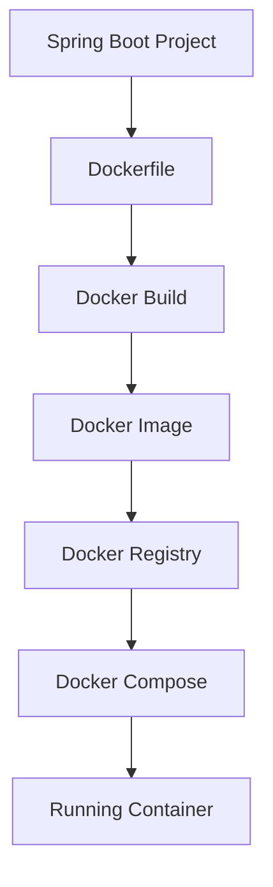
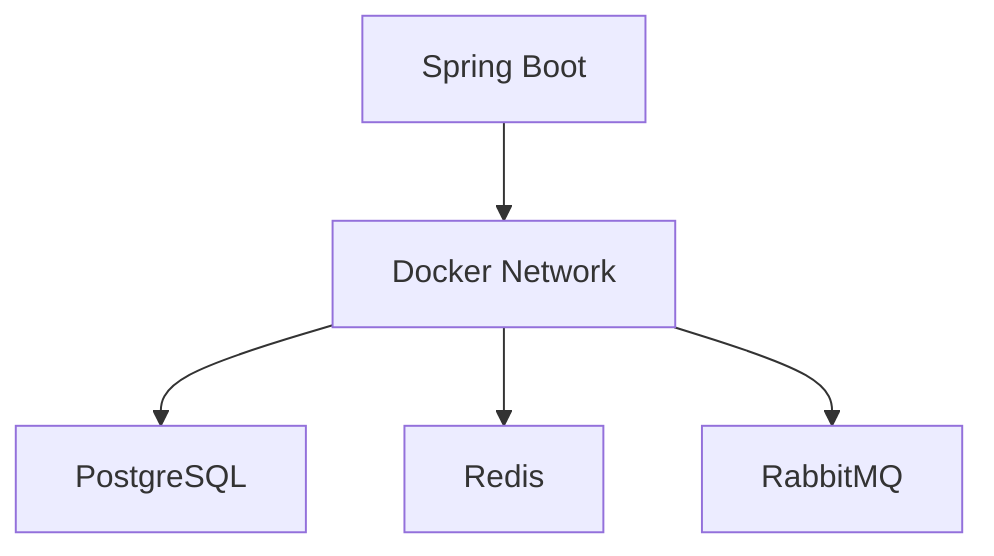
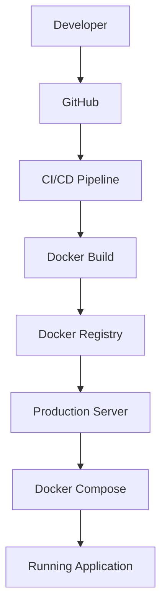

# Docker & Docker Compose Architecture

## Overview

Docker has fundamentally changed the way modern applications are developed, tested, and deployed.

Instead of installing software directly on an operating system, Docker packages applications together with all required dependencies into lightweight, isolated containers.

This repository demonstrates how Docker enables consistent environments, simplifies deployments, and supports production-ready Spring Boot applications.

---

# Repository Goal

This repository answers one engineering question:

> **"How do modern Spring Boot applications move from source code to production using Docker?"**

Everything in this repository is organized around answering that question.

---

# Objectives

This repository demonstrates:

- Docker Architecture
- Images
- Containers
- Dockerfile
- Docker Compose
- Volumes
- Networks
- Multi-Stage Builds
- Environment Variables
- Health Checks
- Production Deployment
- Spring Boot Containerization

---

# High-Level Architecture

```text
                    Developer

                        │

                        ▼

               Spring Boot Project

                        │

                        ▼

                  Dockerfile

                        │

                        ▼

                 Docker Build

                        │

                        ▼

                  Docker Image

                        │

                        ▼

                Docker Registry

                        │

                        ▼

              Production Server

                        │

                        ▼

              Docker Compose

                        │

        ┌───────────────┼───────────────┐
        │               │               │
        ▼               ▼               ▼

 Spring Boot      PostgreSQL        Redis

        │               │               │
        └───────────────┼───────────────┘

                Docker Network

                        │

                        ▼

                  Docker Volume
```

---

# Docker Architecture

Docker consists of several components.

```text
Developer

↓

Docker CLI

↓

Docker Engine

↓

Docker Images

↓

Docker Containers
```

---

## Docker CLI

The Docker CLI allows developers to interact with Docker.

Example

```bash
docker build

docker run

docker compose up
```

---

## Docker Engine

Docker Engine is responsible for

- Building Images
- Creating Containers
- Managing Networks
- Managing Volumes
- Running Containers

It is the core runtime of Docker.

---

## Docker Images

Docker Images are immutable templates.

They contain

- Operating System
- Runtime
- Dependencies
- Application
- Startup Instructions

Images are portable.

---

## Docker Containers

Containers are running instances of Images.

Containers provide

- Process Isolation
- Filesystem Isolation
- Network Isolation

Applications execute inside containers.

---

# Complete Development Flow

```text
Write Code

↓

Spring Boot Project

↓

Dockerfile

↓

Docker Build

↓

Docker Image

↓

Docker Run

↓

Container

↓

Application Running
```

---

# Multi-Container Architecture

Modern applications consist of multiple services.

Example

```text
Spring Boot

↓

Docker Network

↓

PostgreSQL

↓

Docker Network

↓

Redis

↓

Docker Network

↓

RabbitMQ
```

Docker Compose manages all services together.

---

# Docker Compose Architecture

```text
docker-compose.yml

↓

Docker Compose

↓

Create Network

↓

Create Volumes

↓

Build Images

↓

Create Containers

↓

Start Services

↓

Application Ready
```

---

# Spring Boot Deployment Architecture

```text
Git Repository

↓

GitHub Actions

↓

Build Jar

↓

Docker Build

↓

Docker Image

↓

Docker Registry

↓

Production Server

↓

Docker Compose

↓

Running Containers
```

---

# Networking Architecture

Containers communicate through Docker Networks.

```text
Spring Boot

↓

Docker Network

↓

PostgreSQL

↓

Docker DNS

↓

Container Name

↓

Connection Established
```

Applications never need hardcoded IP addresses.

---

# Storage Architecture

Containers are temporary.

Persistent data is stored using Docker Volumes.

```text
Spring Boot

↓

Logs

↓

Docker Volume

↓

Host Storage
```

Database

```text
PostgreSQL

↓

Docker Volume

↓

Persistent Data
```

---

# Configuration Architecture

Configuration is injected during runtime.

```text
Environment Variables

↓

Docker Compose

↓

Container

↓

Spring Boot

↓

Application Configuration
```

The Docker Image remains unchanged across environments.

---

# Health Check Architecture

```text
Container Started

↓

Health Check

↓

Spring Boot Actuator

↓

/actuator/health

↓

Healthy

↓

Ready
```

Applications become available only after successful health checks.

---

# Multi-Stage Build Architecture

```text
Builder Stage

↓

Compile Spring Boot

↓

Executable Jar

↓

Runtime Stage

↓

JRE

↓

Production Image
```

Only the runtime artifacts are included in the final image.

---

# Production Deployment Flow

```text
Developer

↓

Git Push

↓

CI/CD Pipeline

↓

Run Tests

↓

Build Docker Image

↓

Push Image

↓

Docker Registry

↓

Production Server

↓

docker compose pull

↓

docker compose up -d

↓

Application Running
```

---

# Container Lifecycle

```text
Create

↓

Start

↓

Running

↓

Healthy

↓

Stop

↓

Restart

↓

Remove
```

Containers are designed to be disposable.

---

# Image Lifecycle

```text
Dockerfile

↓

docker build

↓

Docker Image

↓

Docker Registry

↓

docker pull

↓

docker run

↓

Container
```

Images remain immutable throughout their lifecycle.

---

# Docker Compose Lifecycle

```text
docker compose up

↓

Create Network

↓

Create Volumes

↓

Build Images

↓

Start Containers

↓

Health Checks

↓

Application Ready
```

---

# Telemedicine HMS Architecture

```text
API Gateway

↓

Patient Service

↓

Doctor Service

↓

Appointment Service

↓

Notification Service

↓

PostgreSQL

↓

Redis

↓

RabbitMQ
```

Every service runs inside its own Docker container while sharing Docker Networks and Volumes.

---

# Production Best Practices

The architecture follows these principles:

- Stateless Containers
- Persistent Storage
- Environment-based Configuration
- Multi-Stage Builds
- Health Monitoring
- Official Base Images
- Version Pinning
- Docker Networks
- Docker Volumes
- CI/CD Integration

---

# Mermaid Diagram — Docker Workflow



---

# Mermaid Diagram — Multi-Container Architecture



---

# Mermaid Diagram — Production Deployment



---

# Key Takeaways

- Docker packages applications and dependencies into portable containers.
- Docker Images are immutable blueprints used to create containers.
- Docker Compose simplifies running multi-container applications.
- Docker Networks enable secure communication between services.
- Docker Volumes provide persistent storage independent of container lifecycle.
- Multi-stage builds create smaller, faster, and more secure production images.
- Environment variables keep configuration separate from application code.
- Health checks ensure containers are ready before serving traffic.
- These practices closely match production deployment workflows used in modern cloud-native Spring Boot applications.